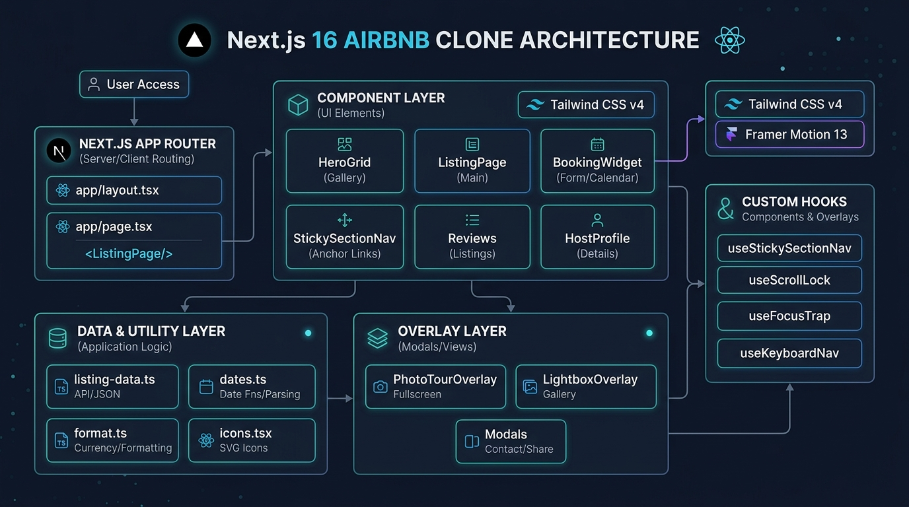
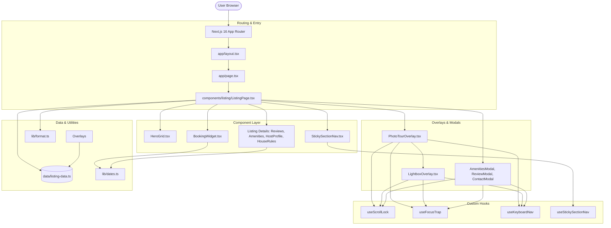

# Architectural Overview — Airbnb Clone

This document details the system architecture, component breakdown, data flow, and interaction model for the **Airbnb Clone (Listing Page)** application.

---

## 1. High-Level Architecture Diagram

---

## 2. Component Hierarchy & Data Flow

1. **`app/page.tsx`**: Entry point rendering `<ListingPage />`.
2. **`ListingPage.tsx`**: State coordinator managing active overlays:
   - `isPhotoTourOpen`: Opens `<PhotoTourOverlay />`
   - `lightboxIndex`: Opens `<LightboxOverlay />`
   - `isAmenitiesModalOpen`, `isReviewsModalOpen`: Auxiliary modals.
3. **`BookingWidget.tsx`**: Sticky right-column card with inline calendar date range selection (`BookingDateRange`), guest counter stepper (`GuestStepperPopover`), and cost computation (`lib/dates.ts`).
4. **`StickySectionNav.tsx`**: Uses `IntersectionObserver` to highlight active section scroll targets (`#photos`, `#overview`, `#amenities`, `#reviews`, `#location`).

---

## 3. Technology Stack & Key Libraries

- **Framework:** Next.js 16 (App Router)
- **Language:** TypeScript 6
- **Styling:** Tailwind CSS v4
- **Animations:** Framer Motion 13 (with `useReducedMotion()`)
- **Icons:** Lucide React (`lucide-react`)
